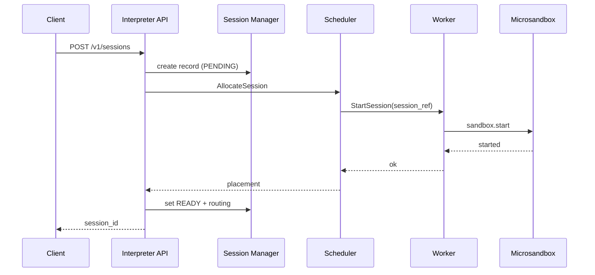
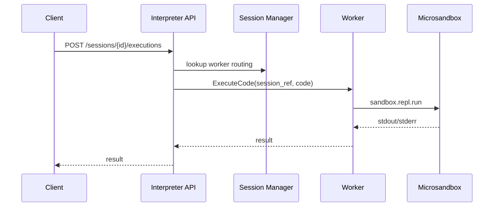
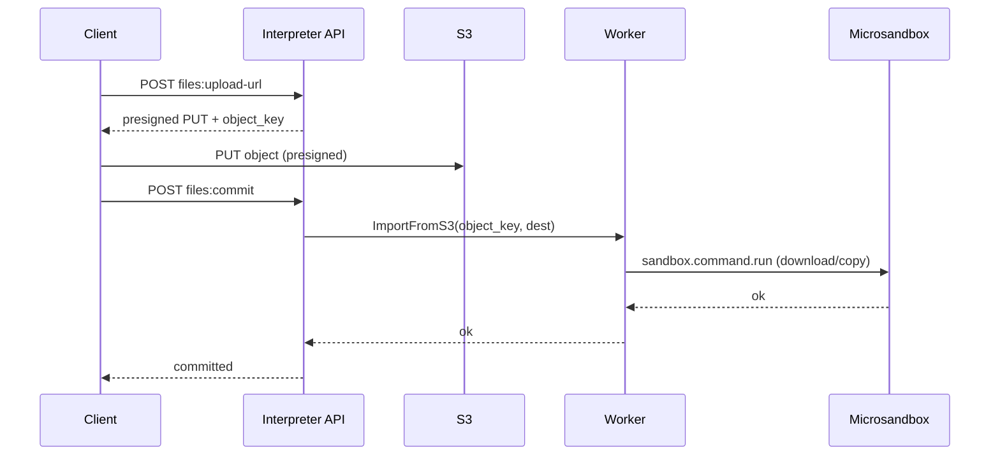

# MicroVM Code Interpreter Service on AWS (Microsandbox)

**Status:** Draft  
**Date:** 2026-01-06  
**Primary runtime:** Microsandbox (microVM sandboxes exposed via server HTTP + JSON-RPC)  

---

## 1. Overview

This document specifies a production architecture for a **session-based code interpreter service** that executes **untrusted, LLM-generated code** (Python + Node.js initially) on AWS. The system is **layered** to scale independently at each tier and is structured with a strict **Control Plane / Data Plane** separation.

Microsandbox is used as the sandbox runtime so we do not reinvent microVM orchestration. Microsandbox provides:
- Health: `GET /api/v1/health`
- JSON-RPC endpoint: `POST /api/v1/rpc`
- Auth: `Authorization: Bearer <API_KEY>`
- Methods: `sandbox.start`, `sandbox.stop`, `sandbox.repl.run`, `sandbox.command.run`, `sandbox.metrics.get`

---

## 2. Requirements

### 2.1 Functional
1. Execute untrusted code (Python, Node.js).
2. Session-based execution: create session → run multiple snippets/commands with state preserved.
3. File exchange: upload inputs to sandbox; download outputs/artifacts.
4. Observable execution: stdout/stderr, exit status, timing, metrics; optional streaming.
5. Multi-tenant safety: isolation between sessions/tenants.
6. Runtime/image selection via allowlisted catalog (base images, pinned digests).

### 2.2 Non-Functional
- Strong isolation boundary (microVM) and defense-in-depth.
- Horizontal scale at edge/API/control plane and worker pool.
- HA across ≥2 AZs.
- Cost control via quotas, TTL/idle culling, bin-packing.

---

## 3. Threat Model

### 3.1 Assets
- Worker host integrity and control plane integrity
- Tenant data (inputs, outputs, artifacts)
- Platform secrets (tokens, AWS creds)
- Availability

### 3.2 Trust Boundaries
- Public client → Control plane
- Control plane → Data plane
- Sandbox microVM boundary (untrusted code inside)
- Network egress boundary

### 3.3 Threats & Mitigations (high level)
- Sandbox escape: microVM isolation; hardened worker AMI; minimal host surface; rapid patching.
- Exfiltration: default deny egress; allowlists; egress proxy; VPC/NFW logging.
- DoS: per-tenant quotas; execution timeouts; limits on memory/cpu/disk; request size limits.
- Supply chain: allowlisted images; scanning; pinned digests; controlled package install egress.
- Abuse (mining/scanning): egress deny by default; anomaly detection.

---

## 4. High-Level Architecture

### 4.1 Component Split
- **Control Plane (CP):** authentication/authorization, session lifecycle, scheduling/placement, quotas, routing, metadata, audit.
- **Data Plane (DP):** worker fleet running Microsandbox server; sandboxes created/executed; import/export files; metrics.
- **SDK Layer:** client SDKs for apps/agents.

### 4.2 AWS Topology (conceptual)
```mermaid
flowchart TB
  U[Client Apps / Agent Services] --> ALB[Public ALB (HTTPS)]

  subgraph CP[Control Plane (EKS/ECS in private subnets)]
    API[Interpreter API
Sessions/Exec/Files/Metrics]
    AUTH[AuthN/AuthZ
(Cognito/OIDC + JWT)]
    SESS[Session Manager]
    QUOTA[Quota + Rate Limits]
    SCHED[Scheduler/Placement]
    META[(DynamoDB)]
    Q[(SQS - optional async)]
    OBS[Telemetry/Audit
CloudWatch/X-Ray]
  end

  subgraph DP[Data Plane (EC2 ASG workers in private subnets)]
    SD[Service Discovery
Cloud Map]
    W[Worker Nodes
Microsandbox Server]
  end

  S3[(S3 Artifacts)]
  ECR[(ECR Images)]

  ALB --> API
  API --> AUTH
  API --> QUOTA
  API --> SESS
  SESS --> META
  SESS --> SCHED
  SCHED --> SD
  API --> SD
  SD --> W
  API --> S3
  W --> S3
  W --> ECR
  API --> OBS
  W --> OBS
  SCHED --> Q
```

---

## 5. Component Specifications

### 5.1 Public API Gateway (ALB)
**Purpose:** single HTTPS entry point; TLS termination; routes to Interpreter API.  
**Scope:** path routing, WAF integration, request size/time limits.

### 5.2 Interpreter API (CP)
**Purpose:** northbound API for sessions/executions/files/metrics.  
**Scope:** validation, authZ, quotas, routing to correct worker, SSE/WebSocket streaming (optional).

### 5.3 AuthN/AuthZ (CP)
**Purpose:** enforce tenant/user permissions and least privilege.  
**Scope:** JWT validation, scope checks, tenant mapping, service tokens.

### 5.4 Session Manager (CP)
**Purpose:** session lifecycle and routing map (`session_id → worker_id + sandbox`).  
**Scope:** create/terminate, idle/TTL enforcement, affinity routing, store metadata in DynamoDB.

### 5.5 Scheduler / Placement (CP)
**Purpose:** decide which worker hosts new sessions.  
**Scope:** bin-pack by CPU/RAM, AZ-aware placement, warm pools (optional), backpressure.

### 5.6 Quota/Billing (CP)
**Purpose:** protect platform and manage cost.  
**Scope:** concurrency caps, API rate limits, CPU/mem/time limits, file size limits, egress limits.

### 5.7 Artifact Service (S3)
**Purpose:** durable file exchange and outputs.  
**Scope:** presigned URLs; lifecycle policies; per-tenant prefixes; encryption.

### 5.8 Worker Nodes (DP)
**Purpose:** run untrusted code in microVM sandboxes via Microsandbox server.  
**Scope:** create sandbox, run code/commands, import/export to S3, gather metrics, enforce runtime constraints.

### 5.9 Service Discovery (Cloud Map)
**Purpose:** discover healthy worker endpoints from control plane.

---

## 6. Core Interfaces / Contracts

### 6.1 Northbound REST API (public)
- `POST /v1/sessions` create session
- `GET /v1/sessions/{session_id}` get session
- `DELETE /v1/sessions/{session_id}` terminate session
- `POST /v1/sessions/{session_id}/executions` run code (sync/async)
- `POST /v1/sessions/{session_id}/commands` run command (sync/async)
- `GET /v1/executions/{execution_id}` get execution record
- `GET /v1/executions/{execution_id}/events` SSE stream
- `POST /v1/sessions/{session_id}/files:upload-url` presigned upload
- `POST /v1/sessions/{session_id}/files:commit` worker imports object into sandbox
- `POST /v1/sessions/{session_id}/files:download-url` presigned download
- `GET /v1/sessions/{session_id}/metrics` session metrics

### 6.2 CP ↔ DP gRPC (internal)
- Scheduler: `AllocateSession`, `ReleaseSession`, `ReportWorkerHeartbeat`
- Worker: `StartSession`, `StopSession`, `ExecuteCode`, `RunCommand`, `ImportFromS3`, `ExportToS3`, `GetMetrics`

### 6.3 DP ↔ Microsandbox server (implementation detail)
- `GET /api/v1/health`
- `POST /api/v1/rpc` JSON-RPC
- `sandbox.start` ↔ StartSession
- `sandbox.repl.run` ↔ ExecuteCode
- `sandbox.command.run` ↔ RunCommand
- `sandbox.metrics.get` ↔ GetMetrics
- `sandbox.stop` ↔ StopSession

---

## 7. Data Flows

### 7.1 Create Session


### 7.2 Execute Code (stateful)


### 7.3 Large File Upload via S3


---

## 8. Scaling Model (Illustrative)

### 8.1 Baseline assumptions
- Default sandbox: 1 vCPU, 512 MiB (policy-driven)
- Worker instance: 16 vCPU, 32 GiB
- CPU-limited: ~16 concurrent sessions per worker
- Headroom: 30%

### 8.2 Formula
- Workers needed ≈ `ceil(concurrent_sessions / 16 * 1.3)`

### 8.3 Levers
- Reduce default CPU/mem
- Enforce short idle timeout
- Warm pools for common runtime images
- Async execution queueing to limit concurrent running sandboxes

---

# 9. OpenAPI Bundle (Public API)

> This section is a complete OpenAPI bundle with:
> - examples for main responses
> - an **x-amazon-apigateway** section (useful if you front via API Gateway in the future)

```yaml
openapi: 3.1.0
info:
  title: Code Interpreter Platform API
  version: 1.0.0
  description: Session-backed, multi-tenant untrusted code execution using microVM sandboxes.
servers:
  - url: https://api.example.com

x-amazon-apigateway-request-validators:
  all:
    validateRequestBody: true
    validateRequestParameters: true

x-amazon-apigateway-request-validator: all

x-amazon-apigateway-gateway-responses:
  DEFAULT_4XX:
    responseTemplates:
      application/json: '{"code":"BAD_REQUEST","message":$context.error.messageString}'
  DEFAULT_5XX:
    responseTemplates:
      application/json: '{"code":"INTERNAL","message":"Internal server error"}'

components:
  securitySchemes:
    bearerAuth:
      type: http
      scheme: bearer
      bearerFormat: JWT

  schemas:
    Error:
      type: object
      required: [code, message]
      properties:
        code: { type: string }
        message: { type: string }
        details: { type: object, additionalProperties: true }
      example:
        code: RESOURCE_NOT_FOUND
        message: Session not found

    RuntimeSpec:
      type: object
      required: [language]
      properties:
        language:
          type: string
          enum: [python, nodejs]
        image:
          type: string
          description: Optional runtime image override (must be allowlisted).
        version:
          type: string
          description: Optional runtime version label.
      example:
        language: python
        image: microsandbox/python
        version: "3.12"

    ResourceLimits:
      type: object
      properties:
        cpus: { type: integer, minimum: 1 }
        memory_mib: { type: integer, minimum: 128 }
        disk_mib: { type: integer, minimum: 256 }
      example:
        cpus: 1
        memory_mib: 1024
        disk_mib: 2048

    EgressPolicy:
      type: object
      required: [mode]
      properties:
        mode:
          type: string
          enum: [deny_all, allow_all, allowlist]
        allowlist:
          type: array
          items: { type: string }
      example:
        mode: deny_all
        allowlist: []

    SessionCreateRequest:
      type: object
      required: [runtime]
      properties:
        runtime: { $ref: '#/components/schemas/RuntimeSpec' }
        resources: { $ref: '#/components/schemas/ResourceLimits' }
        egress_policy: { $ref: '#/components/schemas/EgressPolicy' }
        ttl_seconds: { type: integer, minimum: 60, example: 3600 }
        idle_timeout_seconds: { type: integer, minimum: 30, example: 900 }
        metadata:
          type: object
          additionalProperties: true

    Session:
      type: object
      required: [session_id, state, created_at]
      properties:
        session_id: { type: string }
        state: { type: string, enum: [STARTING, READY, STOPPING, STOPPED, ERROR] }
        created_at: { type: string, format: date-time }
        expires_at: { type: string, format: date-time }
        idle_expires_at: { type: string, format: date-time }
        runtime: { $ref: '#/components/schemas/RuntimeSpec' }
        resources: { $ref: '#/components/schemas/ResourceLimits' }
        egress_policy: { $ref: '#/components/schemas/EgressPolicy' }
      example:
        session_id: sess_abc123
        state: READY
        created_at: "2026-01-06T20:10:00Z"
        expires_at: "2026-01-06T21:10:00Z"
        idle_expires_at: "2026-01-06T20:25:00Z"
        runtime:
          language: python
          image: microsandbox/python
        resources:
          cpus: 1
          memory_mib: 1024
          disk_mib: 2048
        egress_policy:
          mode: deny_all
          allowlist: []

    ExecutionCreateRequest:
      type: object
      required: [code]
      properties:
        code: { type: string }
        timeout_seconds: { type: integer, minimum: 1, maximum: 600, default: 30 }
        mode: { type: string, enum: [sync, async], default: sync }
        capture_paths:
          type: array
          items: { type: string }
        correlation_id: { type: string }
      example:
        code: "print('Hello')"
        timeout_seconds: 20
        mode: sync
        capture_paths: ["/workspace/output.png"]
        correlation_id: "req-001"

    Execution:
      type: object
      required: [execution_id, session_id, status, created_at]
      properties:
        execution_id: { type: string }
        session_id: { type: string }
        status: { type: string, enum: [QUEUED, RUNNING, COMPLETED, TIMEOUT, FAILED, CANCELED] }
        created_at: { type: string, format: date-time }
        started_at: { type: string, format: date-time }
        finished_at: { type: string, format: date-time }
        stdout: { type: string }
        stderr: { type: string }
        has_error: { type: boolean }
        exit_code: { type: integer }
        timing_ms:
          type: object
          properties:
            queue: { type: integer }
            run: { type: integer }
        artifacts:
          type: array
          items:
            type: object
            required: [path]
            properties:
              path: { type: string }
              s3_key: { type: string }
              download_url: { type: string }
      example:
        execution_id: exec_001
        session_id: sess_abc123
        status: COMPLETED
        created_at: "2026-01-06T20:12:00Z"
        started_at: "2026-01-06T20:12:00Z"
        finished_at: "2026-01-06T20:12:01Z"
        stdout: "Hello\n"
        stderr: ""
        has_error: false
        exit_code: 0
        timing_ms:
          queue: 0
          run: 43
        artifacts:
          - path: "/workspace/output.png"
            s3_key: "t-123/sess_abc123/output.png"
            download_url: "https://presigned.example.com/..."

    CommandRequest:
      type: object
      required: [command]
      properties:
        command: { type: string }
        args:
          type: array
          items: { type: string }
        timeout_seconds: { type: integer, minimum: 1, maximum: 600, default: 30 }
        mode: { type: string, enum: [sync, async], default: sync }
      example:
        command: "ls"
        args: ["-la", "/workspace"]
        timeout_seconds: 10
        mode: sync

    FileUploadUrlRequest:
      type: object
      required: [path, content_type, size_bytes]
      properties:
        path: { type: string }
        content_type: { type: string }
        size_bytes: { type: integer, minimum: 1 }
      example:
        path: "/workspace/input.csv"
        content_type: "text/csv"
        size_bytes: 10485760

    FileUploadUrlResponse:
      type: object
      required: [upload_url, object_key, headers]
      properties:
        upload_url: { type: string }
        object_key: { type: string }
        headers:
          type: object
          additionalProperties: { type: string }
      example:
        upload_url: "https://s3-presigned-put..."
        object_key: "t-123/sess_abc123/input.csv"
        headers:
          Content-Type: "text/csv"

    FileCommitRequest:
      type: object
      required: [path, object_key]
      properties:
        path: { type: string }
        object_key: { type: string }
      example:
        path: "/workspace/input.csv"
        object_key: "t-123/sess_abc123/input.csv"

    FileDownloadUrlRequest:
      type: object
      required: [path]
      properties:
        path: { type: string }
      example:
        path: "/workspace/result.parquet"

    FileDownloadUrlResponse:
      type: object
      required: [download_url]
      properties:
        download_url: { type: string }
      example:
        download_url: "https://s3-presigned-get..."

    MetricsResponse:
      type: object
      properties:
        cpu_usage_percent: { type: number }
        memory_usage_mib: { type: number }
        disk_usage_bytes: { type: integer }
        running: { type: boolean }
      example:
        cpu_usage_percent: 12.4
        memory_usage_mib: 380.1
        disk_usage_bytes: 123456789
        running: true

security:
  - bearerAuth: []

paths:
  /v1/sessions:
    post:
      summary: Create a session-backed sandbox
      operationId: createSession
      requestBody:
        required: true
        content:
          application/json:
            schema: { $ref: '#/components/schemas/SessionCreateRequest' }
      responses:
        '201':
          description: Session created
          content:
            application/json:
              schema: { $ref: '#/components/schemas/Session' }
        '400':
          description: Invalid request
          content:
            application/json:
              schema: { $ref: '#/components/schemas/Error' }
        '429':
          description: Quota exceeded
          content:
            application/json:
              schema: { $ref: '#/components/schemas/Error' }

  /v1/sessions/{session_id}:
    get:
      summary: Get session details
      operationId: getSession
      parameters:
        - in: path
          name: session_id
          required: true
          schema: { type: string }
      responses:
        '200':
          description: Session
          content:
            application/json:
              schema: { $ref: '#/components/schemas/Session' }
        '404':
          description: Not found
          content:
            application/json:
              schema: { $ref: '#/components/schemas/Error' }

    delete:
      summary: Stop and delete a session
      operationId: deleteSession
      parameters:
        - in: path
          name: session_id
          required: true
          schema: { type: string }
      responses:
        '204':
          description: Deleted

  /v1/sessions/{session_id}/executions:
    post:
      summary: Execute code in the session sandbox
      operationId: executeCode
      parameters:
        - in: path
          name: session_id
          required: true
          schema: { type: string }
      requestBody:
        required: true
        content:
          application/json:
            schema: { $ref: '#/components/schemas/ExecutionCreateRequest' }
      responses:
        '200':
          description: Synchronous execution result
          content:
            application/json:
              schema: { $ref: '#/components/schemas/Execution' }
        '202':
          description: Accepted (async)
          content:
            application/json:
              schema: { $ref: '#/components/schemas/Execution' }
        '404':
          description: Session not found
          content:
            application/json:
              schema: { $ref: '#/components/schemas/Error' }

  /v1/sessions/{session_id}/commands:
    post:
      summary: Execute a shell command in the session sandbox
      operationId: runCommand
      parameters:
        - in: path
          name: session_id
          required: true
          schema: { type: string }
      requestBody:
        required: true
        content:
          application/json:
            schema: { $ref: '#/components/schemas/CommandRequest' }
      responses:
        '200':
          description: Command result
          content:
            application/json:
              schema: { $ref: '#/components/schemas/Execution' }
        '202':
          description: Accepted (async)
          content:
            application/json:
              schema: { $ref: '#/components/schemas/Execution' }

  /v1/executions/{execution_id}:
    get:
      summary: Get execution status/result
      operationId: getExecution
      parameters:
        - in: path
          name: execution_id
          required: true
          schema: { type: string }
      responses:
        '200':
          description: Execution record
          content:
            application/json:
              schema: { $ref: '#/components/schemas/Execution' }
        '404':
          description: Not found
          content:
            application/json:
              schema: { $ref: '#/components/schemas/Error' }

  /v1/executions/{execution_id}/events:
    get:
      summary: Stream execution events (SSE)
      operationId: streamExecutionEvents
      parameters:
        - in: path
          name: execution_id
          required: true
          schema: { type: string }
      responses:
        '200':
          description: text/event-stream
          content:
            text/event-stream:
              schema: { type: string }

  /v1/sessions/{session_id}/files:upload-url:
    post:
      summary: Create a presigned S3 upload URL
      operationId: createUploadUrl
      parameters:
        - in: path
          name: session_id
          required: true
          schema: { type: string }
      requestBody:
        required: true
        content:
          application/json:
            schema: { $ref: '#/components/schemas/FileUploadUrlRequest' }
      responses:
        '200':
          description: Presigned URL + object key
          content:
            application/json:
              schema: { $ref: '#/components/schemas/FileUploadUrlResponse' }

  /v1/sessions/{session_id}/files:commit:
    post:
      summary: Commit uploaded object into sandbox filesystem
      operationId: commitUploadedFile
      parameters:
        - in: path
          name: session_id
          required: true
          schema: { type: string }
      requestBody:
        required: true
        content:
          application/json:
            schema: { $ref: '#/components/schemas/FileCommitRequest' }
      responses:
        '202':
          description: Import scheduled (returns an execution record)
          content:
            application/json:
              schema: { $ref: '#/components/schemas/Execution' }

  /v1/sessions/{session_id}/files:download-url:
    post:
      summary: Create a presigned S3 download URL
      operationId: createDownloadUrl
      parameters:
        - in: path
          name: session_id
          required: true
          schema: { type: string }
      requestBody:
        required: true
        content:
          application/json:
            schema: { $ref: '#/components/schemas/FileDownloadUrlRequest' }
      responses:
        '200':
          description: Presigned download URL
          content:
            application/json:
              schema: { $ref: '#/components/schemas/FileDownloadUrlResponse' }

  /v1/sessions/{session_id}/metrics:
    get:
      summary: Get resource usage metrics for a session
      operationId: getSessionMetrics
      parameters:
        - in: path
          name: session_id
          required: true
          schema: { type: string }
      responses:
        '200':
          description: Metrics
          content:
            application/json:
              schema: { $ref: '#/components/schemas/MetricsResponse' }
```

---

# 10. Recommended AWS Deployment Configuration Sketch

## 10.1 Network & Subnets
- 1 VPC, 2–3 AZs
- Public subnets: ALB, NAT Gateway (if needed)
- Private subnets:
  - Control Plane (EKS nodes / ECS tasks)
  - Data Plane (EC2 ASG worker nodes)

## 10.2 Control Plane (EKS recommended)
- Deploy services as separate Kubernetes Deployments:
  - `interpreter-api`
  - `session-manager`
  - `scheduler`
  - `quota-service`
- DynamoDB for session/execution metadata.
- Optional SQS for async execution tasks.
- CloudWatch Logs, X-Ray/OpenTelemetry.

## 10.3 Data Plane (EC2 ASG)
- Dedicated ASG per AZ for workers.
- Each worker runs:
  - `microsandbox-server`
  - `worker-agent` (your gRPC server exposing WorkerService)
  - optional `egress-proxy` (Envoy)
- Pre-pull runtime images (ECR) on boot to reduce cold starts.

## 10.4 Worker Discovery
**Option A (recommended): Cloud Map**
- Register each worker agent endpoint in Cloud Map with health checks.
- Scheduler queries Cloud Map to find healthy endpoints.

**Option B: Internal NLB + target registration**
- Expose worker-agent gRPC via internal NLB.
- Use target groups per AZ; scheduler does least-loaded routing.

## 10.5 mTLS between CP ↔ DP
- Use a service mesh (AWS App Mesh) or SPIFFE/SPIRE-like cert automation.
- Short-lived certs; mutual verification.
- Enforce policy at worker-agent: only CP identities can call WorkerService.

## 10.6 Security Groups (high level)
- **ALB SG**: inbound 443 from internet; outbound to CP service nodes.
- **CP SG**:
  - inbound from ALB on service ports (e.g., 443/8443)
  - outbound to DynamoDB/S3 endpoints (via VPC endpoints recommended)
  - outbound to DP worker-agent on gRPC port (e.g., 8443)
- **DP SG**:
  - inbound gRPC from CP SG only
  - outbound restricted; allow to S3 (via VPC endpoint), ECR, CloudWatch
  - optional egress only via NAT + firewall

## 10.7 VPC Endpoints (recommended)
- S3 Gateway endpoint
- DynamoDB Gateway endpoint
- Interface endpoints for ECR (api+dkr), CloudWatch Logs, STS, SSM

## 10.8 Observability
- Worker-agent emits structured logs with `tenant_id/session_id/execution_id`.
- Export sandbox metrics on interval and per execution.

---

## 11. Internal gRPC Protos (CP ↔ DP)

> Keep this in a repo as the single source of truth for CP↔DP contract.

```proto
syntax = "proto3";

package interpreter.v1;

message SessionRef {
  string tenant_id  = 1;
  string session_id = 2;
  string namespace  = 3;
  string sandbox    = 4;
}

message RuntimeSpec {
  enum Language {
    LANGUAGE_UNSPECIFIED = 0;
    PYTHON = 1;
    NODEJS = 2;
  }
  Language language = 1;
  string image = 2;
  string profile = 3;
}

message ResourceLimits {
  uint32 cpus       = 1;
  uint32 memory_mib = 2;
  uint32 disk_mib   = 3;
}

message EgressPolicy {
  enum Mode {
    MODE_UNSPECIFIED = 0;
    DENY_ALL = 1;
    ALLOW_ALL = 2;
    ALLOWLIST = 3;
  }
  Mode mode = 1;
  repeated string allowlist = 2;
}

message Timing {
  uint64 queued_ms = 1;
  uint64 run_ms = 2;
  uint64 total_ms = 3;
}

message ArtifactRef {
  string path = 1;
  string s3_key = 2;
}

message ExecutionResult {
  enum Status {
    STATUS_UNSPECIFIED = 0;
    QUEUED = 1;
    RUNNING = 2;
    COMPLETED = 3;
    TIMEOUT = 4;
    FAILED = 5;
    CANCELED = 6;
  }
  string execution_id = 1;
  Status status = 2;
  string stdout = 3;
  string stderr = 4;
  bool has_error = 5;
  int32 exit_code = 6;
  Timing timing = 7;
  repeated ArtifactRef artifacts = 8;
  string error_code = 9;
  string error_message = 10;
}

service SchedulerService {
  rpc AllocateSession(AllocateSessionRequest) returns (AllocateSessionResponse);
  rpc ReleaseSession(ReleaseSessionRequest) returns (ReleaseSessionResponse);
  rpc ReportWorkerHeartbeat(WorkerHeartbeat) returns (HeartbeatAck);
}

message AllocateSessionRequest {
  string tenant_id = 1;
  RuntimeSpec runtime = 2;
  ResourceLimits limits = 3;
  EgressPolicy egress = 4;
  string requested_namespace = 5;
  string requested_sandbox = 6;
  string az_hint = 7;
  string capacity_pool = 8;
}

message AllocateSessionResponse {
  string worker_id = 1;
  string worker_endpoint = 2;
  SessionRef session_ref = 3;
}

message ReleaseSessionRequest {
  SessionRef session_ref = 1;
  string worker_id = 2;
}

message ReleaseSessionResponse {
  bool released = 1;
}

message WorkerHeartbeat {
  string worker_id = 1;
  string az = 2;
  uint32 total_cpus = 3;
  uint32 used_cpus = 4;
  uint32 total_memory_mib = 5;
  uint32 used_memory_mib = 6;
  uint32 active_sessions = 7;
  bool healthy = 8;
  string worker_version = 9;
}

message HeartbeatAck {
  bool ok = 1;
}

service WorkerService {
  rpc Health(HealthRequest) returns (HealthResponse);
  rpc StartSession(StartSessionRequest) returns (StartSessionResponse);
  rpc StopSession(StopSessionRequest) returns (StopSessionResponse);
  rpc ExecuteCode(ExecuteCodeRequest) returns (ExecutionResult);
  rpc RunCommand(RunCommandRequest) returns (ExecutionResult);
  rpc ImportFromS3(ImportFromS3Request) returns (ExecutionResult);
  rpc ExportToS3(ExportToS3Request) returns (ExecutionResult);
  rpc GetMetrics(GetMetricsRequest) returns (GetMetricsResponse);
}

message HealthRequest {}
message HealthResponse {
  bool healthy = 1;
  string message = 2;
}

message StartSessionRequest {
  SessionRef session_ref = 1;
  RuntimeSpec runtime = 2;
  ResourceLimits limits = 3;
  EgressPolicy egress = 4;
  repeated string envs = 5;
  repeated string volumes = 6;
  repeated string ports = 7;
  string workdir = 8;
}

message StartSessionResponse {
  bool started = 1;
  string message = 2;
}

message StopSessionRequest {
  SessionRef session_ref = 1;
  bool force = 2;
}

message StopSessionResponse {
  bool stopped = 1;
  string message = 2;
}

message ExecuteCodeRequest {
  SessionRef session_ref = 1;
  RuntimeSpec runtime = 2;
  string code = 3;
  uint32 timeout_seconds = 4;
  string correlation_id = 5;
  repeated ArtifactRef capture_paths = 6;
}

message RunCommandRequest {
  SessionRef session_ref = 1;
  string command = 2;
  repeated string args = 3;
  uint32 timeout_seconds = 4;
  string correlation_id = 5;
}

message ImportFromS3Request {
  SessionRef session_ref = 1;
  string bucket = 2;
  string key = 3;
  string dest_path = 4;
  uint32 timeout_seconds = 5;
  string correlation_id = 6;
}

message ExportToS3Request {
  SessionRef session_ref = 1;
  string source_path = 2;
  string bucket = 3;
  string key = 4;
  uint32 timeout_seconds = 5;
  string correlation_id = 6;
}

message GetMetricsRequest {
  SessionRef session_ref = 1;
}

message GetMetricsResponse {
  bool running = 1;
  double cpu_usage_percent = 2;
  double memory_usage_mib = 3;
  uint64 disk_usage_bytes = 4;
}
```

---

## 12. Implementation Notes (Microsandbox mapping)

The worker-agent implements `WorkerService` by calling Microsandbox server:
- `Health` → `GET /api/v1/health`
- `StartSession` → JSON-RPC `sandbox.start`
- `ExecuteCode` → JSON-RPC `sandbox.repl.run`
- `RunCommand` → JSON-RPC `sandbox.command.run`
- `GetMetrics` → JSON-RPC `sandbox.metrics.get`
- `StopSession` → JSON-RPC `sandbox.stop`

---

## 13. Next Steps
1. Decide streaming approach: SSE vs WebSocket vs gRPC streaming.
2. Finalize runtime image catalog (pinned digests; ECR policies).
3. Define egress defaults and package install strategy.
4. Add test plan: escape attempts, DoS patterns, egress validation, quotas.

---

# 14. Design Update: Native Upload into Sandbox (No S3 Required)

This platform will support **native file upload/download directly to/from a session sandbox**.

## 14.1 Approach
Use a **per-session workspace directory** mounted into the sandbox via Microsandbox `volumes` (hostPath → sandbox path). The Worker Agent owns the host-side workspace and provides streaming APIs to put/get files. Because the workspace is mounted into the sandbox, files written by the Worker Agent appear immediately inside the sandbox.

### Key benefits
- No intermediate S3 object for interactive workflows
- Lower latency for small/medium files
- Simpler “upload then execute” UX

### Constraints / considerations
- Worker-local storage consumption and cleanup become critical
- Cross-worker mobility is not supported for a live session (session affinity remains required)
- For very large files or long-term retention, S3 artifacts remain recommended

## 14.2 Interfaces
- Public API adds:
  - `PUT /v1/sessions/{session_id}/files/{path}` (streaming upload)
  - `GET /v1/sessions/{session_id}/files/{path}` (streaming download)
  - (Optional) `POST /v1/sessions/{session_id}/files:mkdir`, `DELETE /v1/sessions/{session_id}/files/{path}`
- Internal gRPC adds:
  - `PutFile(stream PutFileRequest) returns (PutFileResponse)`
  - `GetFile(GetFileRequest) returns (stream GetFileResponse)`

## 14.3 Worker Implementation
- On `StartSession`, Worker Agent:
  1. creates a unique host workspace dir: `/var/lib/interpreter/workspaces/{tenant}/{session}`
  2. passes `volumes: ["/var/lib/interpreter/workspaces/{...}:/workspace"]` to `sandbox.start`
- On `PutFile`, Worker Agent writes bytes to the host workspace path.
- On `GetFile`, Worker Agent reads bytes from the host workspace path.
- Cleanup: on `StopSession` or TTL expiry, recursively delete workspace.

---

# 15. GitHub Repository Layout

This section describes the repos to create for each component, along with **README.md** and **Architecture.md** templates containing the design details relevant to that component.

## 15.1 Recommended Repos

1. **contracts** (shared OpenAPI + gRPC protos + common schemas)
2. **control-plane-api** (Interpreter API service)
3. **session-manager** (session lifecycle + routing map)
4. **scheduler** (placement + worker selection)
5. **quota-service** (rate limits + concurrency/resource quotas)
6. **worker-agent** (DP gRPC server that wraps Microsandbox)
7. **worker-images** (runtime image build definitions + hardening)
8. **sdk-python** (client SDK)
9. **sdk-typescript** (client SDK)
10. **infra-aws** (Terraform/CDK + EKS manifests/Helm + AMIs + CI/CD)
11. **observability** (dashboards, alerts, log schemas, OTel collectors configs)

> Optional: If you prefer fewer repos, you can merge 2–5 into a single `control-plane` repo, but keeping them separate helps independent deploy/ownership.

---

# 16. Repo Templates

## 16.0 Shared Python/FastAPI Standards (applies to all Python service repos)

All control-plane and data-plane services will be implemented in **Python 3.12+** using **FastAPI**. Recommended common standards:

### Tooling
- **Packaging**: Poetry (preferred) or uv/pip-tools (choose one across all repos)
- **Web server**: Uvicorn (ASGI)
- **Validation**: Pydantic v2 models
- **Testing**: pytest + pytest-asyncio
- **Lint/format**: ruff (format + lint)
- **Typing**: mypy (or pyright)
- **API docs**: FastAPI OpenAPI auto-docs + contract checks against `contracts/openapi/openapi.yaml`

### Observability
- **OpenTelemetry** for traces/metrics/log enrichment (request_id, tenant_id, session_id, execution_id)
- Export to **CloudWatch** (logs) and your chosen trace backend (X-Ray or OTEL collector)

### Service skeleton (recommended structure)
- `app/main.py` (FastAPI app)
- `app/api/` (routers)
- `app/core/` (config, auth, logging)
- `app/services/` (business logic)
- `app/clients/` (gRPC/HTTP clients)
- `tests/`

### Common conventions
- Every request carries `X-Request-Id` (generated if absent)
- Every response includes `X-Request-Id`
- Idempotency keys supported where retries are likely (`correlation_id` / `Idempotency-Key`)
- Strict limits: request body size, execution timeouts, file size limits

### CI (recommended)
- `ruff format --check` and `ruff check`
- `mypy app`
- `pytest -q`
- Build container image
- Run minimal contract tests (OpenAPI + protos)

---

## 16.0.1 Repo Bootstrap Checklist (copy/paste)

Use this checklist to bootstrap each repo consistently.

### Files to add
- `pyproject.toml` (Poetry + deps)
- `README.md`
- `Architecture.md`
- `Dockerfile`
- `.dockerignore`
- `Makefile`
- `.github/workflows/ci.yml`
- `.github/workflows/release.yml` (optional)
- `app/main.py`
- `app/api/health.py`
- `app/core/config.py`
- `app/core/logging.py`
- `tests/test_health.py`

### Standard Makefile targets
- `make fmt` → `ruff format`
- `make lint` → `ruff check`
- `make type` → `mypy app`
- `make test` → `pytest -q`
- `make run` → starts service
- `make docker-build`

### Standard environment variables
- `ENV` (dev/stage/prod)
- `LOG_LEVEL`
- `AWS_REGION`
- `SERVICE_NAME`
- Service-specific:
  - `DDB_TABLE_SESSIONS`
  - `DDB_TABLE_EXECUTIONS`
  - `WORKER_GRPC_TARGET` (CP)
  - `MICROSANDBOX_BASE_URL` (DP)
  - `MICROSANDBOX_API_KEY` (DP)

### GitHub Actions (recommended steps)
- Checkout
- Setup Python 3.12
- Cache Poetry
- `poetry install`
- `make lint && make type && make test`
- Build Docker image

---

## 16.0.2 Copy/Paste Baseline Templates

These templates are intended to be copied into each repo and adjusted as needed.

### A) `Dockerfile` (FastAPI service)
```dockerfile
# syntax=docker/dockerfile:1
FROM python:3.12-slim

ENV PYTHONDONTWRITEBYTECODE=1 \
    PYTHONUNBUFFERED=1

# System deps
RUN apt-get update \
  && apt-get install -y --no-install-recommends curl ca-certificates \
  && rm -rf /var/lib/apt/lists/*

# Create non-root user
RUN useradd -m -u 10001 appuser
WORKDIR /app

# Install Poetry
ENV POETRY_VERSION=1.8.5
RUN pip install --no-cache-dir "poetry==${POETRY_VERSION}"

# Copy dependency files first
COPY pyproject.toml poetry.lock* /app/

# Install deps (no venv inside container)
RUN poetry config virtualenvs.create false \
  && poetry install --only main --no-interaction --no-ansi

# Copy app
COPY app /app/app

USER appuser

EXPOSE 8080

# Default command (override per service)
CMD ["uvicorn", "app.main:app", "--host", "0.0.0.0", "--port", "8080"]
```

> For `worker-agent` (gRPC), change CMD to run the gRPC server module.

### B) `.dockerignore`
```gitignore
__pycache__/
*.pyc
*.pyo
*.pyd
.pytest_cache/
.mypy_cache/
.ruff_cache/
.venv/
dist/
build/
.git/
.github/
*.log
.DS_Store
```

### C) `Makefile`
```makefile
.PHONY: fmt lint type test run docker-build

fmt:
	poetry run ruff format

lint:
	poetry run ruff check

type:
	poetry run mypy app

test:
	poetry run pytest -q

run:
	poetry run uvicorn app.main:app --host 0.0.0.0 --port 8080

docker-build:
	docker build -t $(IMAGE_NAME) .
```

### D) `.github/workflows/ci.yml`
```yaml
name: ci

on:
  pull_request:
  push:
    branches: [ main ]

jobs:
  build-test:
    runs-on: ubuntu-latest
    steps:
      - name: Checkout
        uses: actions/checkout@v4

      - name: Setup Python
        uses: actions/setup-python@v5
        with:
          python-version: '3.12'

      - name: Install Poetry
        run: pip install poetry==1.8.5

      - name: Cache Poetry
        uses: actions/cache@v4
        with:
          path: |
            ~/.cache/pypoetry
            ~/.cache/pip
          key: ${{ runner.os }}-poetry-${{ hashFiles('**/poetry.lock') }}

      - name: Install deps
        run: poetry install --no-interaction

      - name: Lint
        run: poetry run ruff check

      - name: Format check
        run: poetry run ruff format --check

      - name: Type check
        run: poetry run mypy app

      - name: Test
        run: poetry run pytest -q

      - name: Docker build
        run: docker build -t local/test:${{ github.sha }} .
```

### E) `.github/workflows/release.yml` (optional, tag → ECR)
```yaml
name: release

on:
  push:
    tags:
      - 'v*'

jobs:
  push-image:
    runs-on: ubuntu-latest
    permissions:
      id-token: write
      contents: read
    steps:
      - uses: actions/checkout@v4

      - name: Configure AWS credentials (OIDC)
        uses: aws-actions/configure-aws-credentials@v4
        with:
          role-to-assume: ${{ secrets.AWS_ROLE_TO_ASSUME }}
          aws-region: ${{ secrets.AWS_REGION }}

      - name: Login to ECR
        uses: aws-actions/amazon-ecr-login@v2

      - name: Build and push
        env:
          ECR_REPO: ${{ secrets.ECR_REPO }}
          TAG: ${{ github.ref_name }}
        run: |
          docker build -t $ECR_REPO:$TAG .
          docker push $ECR_REPO:$TAG
```

### F) `pyproject.toml` (baseline FastAPI service)
```toml
[tool.poetry]
name = "service"
version = "0.1.0"
description = ""
authors = ["Your Team"]
readme = "README.md"
packages = [{ include = "app" }]

[tool.poetry.dependencies]
python = ">=3.12,<4.0"
fastapi = "^0.115.0"
uvicorn = { version = "^0.30.6", extras = ["standard"] }
pydantic = "^2.8.0"
httpx = "^0.27.0"

[tool.poetry.group.dev.dependencies]
pytest = "^8.3.0"
pytest-asyncio = "^0.23.8"
ruff = "^0.6.9"
mypy = "^1.11.2"

[tool.ruff]
line-length = 100

[tool.mypy]
python_version = "3.12"
strict = true
warn_unused_configs = true

[build-system]
requires = ["poetry-core"]
build-backend = "poetry.core.masonry.api"
```

> Add service-specific dependencies (e.g., `boto3`, `grpcio`, `opentelemetry-*`) as needed.

### G) FastAPI skeleton

#### `app/main.py`
```python
from fastapi import FastAPI

from app.api.health import router as health_router
from app.core.logging import configure_logging
from app.core.config import Settings


def create_app() -> FastAPI:
    settings = Settings()  # loads env
    configure_logging(settings)

    app = FastAPI(title=settings.service_name, version=settings.version)
    app.include_router(health_router, prefix="/v1")

    return app


app = create_app()
```

#### `app/api/health.py`
```python
from fastapi import APIRouter

router = APIRouter(tags=["health"])


@router.get("/health")
async def health() -> dict:
    return {"ok": True}
```

#### `app/core/config.py`
```python
from pydantic import BaseModel
from pydantic_settings import BaseSettings


class Settings(BaseSettings):
    service_name: str = "service"
    version: str = "0.1.0"
    env: str = "dev"
    log_level: str = "INFO"
    aws_region: str = "us-east-1"

    model_config = {"env_prefix": "", "extra": "ignore"}
```

#### `app/core/logging.py`
```python
import logging

from app.core.config import Settings


def configure_logging(settings: Settings) -> None:
    logging.basicConfig(
        level=getattr(logging, settings.log_level.upper(), logging.INFO),
        format="%(asctime)s %(levelname)s %(name)s %(message)s",
    )
```

#### `tests/test_health.py`
```python
from fastapi.testclient import TestClient

from app.main import app


def test_health() -> None:
    client = TestClient(app)
    resp = client.get("/v1/health")
    assert resp.status_code == 200
    assert resp.json() == {"ok": True}
```

---

# 16. Repo Templates

# 16. Repo Templates

Below are suggested contents for **README.md** and **Architecture.md** for each repo. Copy/paste into each repository.

---

## 16.1 Repo: `contracts`

### `README.md`
- **Purpose**: Single source of truth for public and internal API contracts.
- **Contains**:
  - `openapi/openapi.yaml` (public API)
  - `proto/interpreter/v1/*.proto` (CP↔DP)
  - JSON Schemas and shared error codes
- **Versioning**: semantic versioning; backward-compatible changes only on minor.
- **Publishing**:
  - Generate language clients (optional) and publish as artifacts.
- **CI**:
  - lint OpenAPI
  - lint protobuf
  - breaking-change detection

### `Architecture.md`
#### Scope
Defines northbound REST and internal gRPC contracts and shared types.

#### Directory structure
- `openapi/`
- `proto/`
- `schemas/`
- `generated/` (optional)

#### Compatibility policy
- Backward compatible changes: add fields, add endpoints.
- Breaking changes: require major version bump.

#### Release process
- Tag releases; publish generated artifacts.

---

## 16.2 Repo: `control-plane-api`

### `README.md`
- **Purpose**: Public API for sessions, executions, file IO, metrics.
- **Key endpoints**:
  - `/v1/sessions`
  - `/v1/sessions/{id}/executions`
  - `/v1/sessions/{id}/files/*` (native uploads)
- **Dependencies**:
  - DynamoDB (session/execution metadata)
  - Session Manager (internal)
  - Scheduler (internal)
  - Worker Agent (internal)
- **Local dev**:
  - run with localstack (optional)
  - mock Worker Agent
- **Observability**:
  - structured logs, request IDs, tenant IDs

### `Architecture.md`
#### Responsibilities
- AuthZ, quotas (or calls Quota Service)
- Request validation and routing to the correct worker
- Translate public REST calls to internal gRPC calls
- SSE/WebSocket streaming (optional)

#### Key data models
- Session: state, routing, TTL, resources, runtime
- Execution: status transitions, stdout/stderr, artifacts

#### Failure modes
- Worker unavailable → retry/relocate only for non-stateful
- Session not found / expired
- Quota exceeded

#### Scaling
- Stateless; scale horizontally behind ALB
- Cache session routing (e.g., Redis) for hot paths

#### Security
- JWT validation
- Input limits (body sizes, timeouts)
- Audit logs

---

## 16.3 Repo: `session-manager`

### `README.md`
- **Purpose**: Owns session lifecycle and routing map.
- **APIs**: internal gRPC/HTTP used by control-plane-api.
- **Storage**: DynamoDB tables.

### `Architecture.md`
#### Responsibilities
- Create/update/delete session records
- Enforce TTL and idle timeout
- Maintain `session_id → worker_id + sandbox + namespace`
- Provide routing lookup to API

#### Data model (DynamoDB)
- `Sessions` table (PK: session_id)
- `Executions` table (PK: execution_id, GSI on session_id)

#### Scaling
- Stateless service; DynamoDB handles scale

#### Operational concerns
- Reaper job / scheduled cleanup
- Idempotency on create

---

## 16.4 Repo: `scheduler`

### `README.md`
- **Purpose**: Worker selection and placement.
- **Inputs**: requested resources, runtime profile, AZ hints.
- **Outputs**: `worker_endpoint` + session_ref.

### `Architecture.md`
#### Responsibilities
- Maintain view of worker capacity (from heartbeats)
- Choose worker for new sessions
- Enforce placement constraints (AZ, pool)
- Backpressure when capacity is insufficient

#### Algorithms
- Bin-pack (CPU-first) + memory constraints
- Sticky placement for warm pools (optional)

#### Integration
- Cloud Map / NLB discovery

---

## 16.5 Repo: `quota-service`

### `README.md`
- **Purpose**: Rate limits and resource quotas.
- **Limits**: sessions, exec/min, CPU-seconds, memory-seconds, file sizes.

### `Architecture.md`
#### Responsibilities
- Enforce per-tenant quotas
- Provide decision API to control-plane-api
- Emit usage records to billing/metering

#### Storage
- DynamoDB or Redis for counters (choose based on latency needs)

#### Failure behavior
- Fail-closed for high-risk routes (session create), fail-open for low-risk read-only routes (configurable)

---

## 16.6 Repo: `worker-agent`

### `README.md`
- **Purpose**: Data plane gRPC service that wraps Microsandbox server.
- **Runs on**: EC2 worker hosts (ASG) alongside microsandbox-server.
- **Exposes**:
  - `WorkerService` (StartSession/ExecuteCode/RunCommand/PutFile/GetFile/GetMetrics/StopSession)

### `Architecture.md`
#### Responsibilities
- Create host workspace dir per session
- Call Microsandbox JSON-RPC to start/stop and execute code/commands
- Implement native file upload/download by writing/reading host workspace mounted into sandbox
- Collect and return execution output + metrics

#### Workspace & mounts
- Host: `/var/lib/interpreter/workspaces/{tenant}/{session}`
- Sandbox mount: `/workspace`
- StartSession passes `volumes` mapping into `sandbox.start`

#### Native file IO (recommended)
- `PutFile`: stream bytes → write to host path
- `GetFile`: read from host path → stream bytes

#### Security
- mTLS only from control plane identities
- Strict path sanitization (prevent `..` traversal)
- Enforce max file size and allowed paths

#### Failure modes
- Microsandbox server down
- Sandbox start failure
- Disk full on worker

---

## 16.7 Repo: `worker-images`

### `README.md`
- **Purpose**: Build and publish sandbox runtime images and worker AMI/container definitions.
- **Targets**:
  - sandbox runtime images (python/node)
  - worker base image/AMI build scripts

### `Architecture.md`
#### Responsibilities
- Define hardened runtime images
- Pin dependencies and sign images
- Provide CVE scanning and SBOM generation

#### Recommendations
- Separate “base” and “datasci” flavors
- Use ECR with immutable tags + digest pinning

---

## 16.8 Repo: `sdk-python`

### `README.md`
- **Purpose**: Python client SDK.
- **Core API**:
  - `create_session()`
  - `run_code()`
  - `upload_file()` / `download_file()`
  - `close()`

### `Architecture.md`
#### Responsibilities
- Typed wrappers for REST endpoints
- Streaming helpers (SSE/WebSocket)
- Retries with idempotency for safe operations

---

## 16.9 Repo: `sdk-typescript`

### `README.md`
- **Purpose**: TypeScript/Node client SDK.

### `Architecture.md`
#### Responsibilities
- Same as Python SDK; strong typing and browser/node compatibility (as appropriate)

---

## 16.10 Repo: `infra-aws`

### `README.md`
- **Purpose**: AWS infrastructure as code and deploy tooling.
- **Contains**:
  - VPC/subnets
  - ALB + WAF
  - EKS cluster + namespaces
  - ASG worker fleet + launch templates
  - Cloud Map service discovery OR internal NLB
  - VPC endpoints
  - IAM roles/policies

### `Architecture.md`
#### Deployment topology
- ALB in public subnets
- EKS nodes in private subnets
- Worker ASG in private subnets

#### Security groups
- ALB SG: inbound 443; outbound to CP
- CP SG: inbound from ALB; outbound to DP gRPC; outbound to AWS endpoints
- DP SG: inbound gRPC from CP SG only; outbound restricted (S3/ECR/CW)

#### mTLS strategy
- App Mesh or cert automation (SPIFFE/SPIRE-like)
- Rotate certs automatically; validate identity at worker-agent

---

## 16.11 Repo: `observability`

### `README.md`
- **Purpose**: dashboards, alerts, log schemas.
- **Targets**: CloudWatch dashboards, alarms, log filters; OTel collector configs.

### `Architecture.md`
#### Log schema
- Always include: `tenant_id`, `session_id`, `execution_id`, `request_id`

#### Dashboards
- Session creation latency
- Sandbox start failures
- Worker saturation
- Execution error rates

#### Alerts
- Worker health below threshold
- Sandbox start failure spikes
- Disk usage high on workers

---

# 17. Optional Enhancements (future)
- Warm pool per runtime image to reduce startup latency
- Snapshot/restore if Microsandbox adds it
- Multi-region active-active for CP; region-local DP
- Dedicated “artifact export” pipeline to move large outputs to S3 automatically

---

# 18. Agent-Ready Implementation Additions (Highly Recommended)

This section adds the missing details that significantly improve code generation quality and reduce ambiguity.

## 18.1 Golden Path Walkthrough (End-to-End)

### 1) Create session
**Request**
- `POST /v1/sessions`
- Headers:
  - `Authorization: Bearer <JWT>`
  - `X-Request-Id: <uuid>` (generated if missing)
  - `Idempotency-Key: <uuid>` (recommended)

Body (example):
```json
{
  "runtime": { "language": "python", "image": "microsandbox/python" },
  "resources": { "cpus": 1, "memory_mib": 1024, "disk_mib": 2048 },
  "egress_policy": { "mode": "deny_all", "allowlist": [] },
  "ttl_seconds": 3600,
  "idle_timeout_seconds": 900,
  "metadata": { "app": "my-agent", "purpose": "analysis" }
}
```

**Response** `201`
```json
{ "session_id": "sess_abc123", "state": "READY" }
```

### 2) Upload input file (native)
**Request**
- `PUT /v1/sessions/sess_abc123/files/workspace/input.csv`
- Headers:
  - `Content-Type: text/csv`
  - `Content-Length: <bytes>`
  - `X-Request-Id: <uuid>`

Body: raw bytes

**Response** `200`
```json
{ "ok": true, "bytes_written": 10485760, "sha256": "..." }
```

### 3) Execute code
**Request**
- `POST /v1/sessions/sess_abc123/executions`
- Headers: `Idempotency-Key` recommended

Body:
```json
{ "code": "import pandas as pd
print('ok')", "timeout_seconds": 30, "mode": "sync" }
```

**Response** `200`
```json
{ "execution_id": "exec_001", "status": "COMPLETED", "stdout": "ok
", "stderr": "", "exit_code": 0 }
```

### 4) Download output file (native)
**Request**
- `GET /v1/sessions/sess_abc123/files/workspace/output.png`

**Response** `200`
- `Content-Type: image/png`
- Body: raw bytes

### 5) Close session
**Request** `DELETE /v1/sessions/sess_abc123`

**Response** `204`

---

## 18.2 Idempotency + Retry Policy

### Idempotency
- **Idempotent by default**: `GET`, `DELETE`.
- **Idempotent with `Idempotency-Key`**:
  - `POST /v1/sessions`
  - `POST /v1/sessions/{id}/executions`
  - `POST /v1/sessions/{id}/commands`
  - native file `PUT` (treat as idempotent if overwriting is allowed; otherwise support conditional writes)

### Recommended semantics
- Create session: **at-most-once** effect for the same idempotency key.
- Create execution:
  - `sync`: at-most-once for same idempotency key.
  - `async`: at-most-once creation; execution is at-least-once internally (worker retries) but must be deduped by `correlation_id`.

### Retry policy (client + CP)
- Retry on: network timeouts, 502/503/504.
- Do not retry on: 4xx (except 429 with backoff).
- Backoff: exponential with jitter; cap at 2–3 retries.

### Server-side
- Store `Idempotency-Key` result records for:
  - session create (TTL >= session TTL)
  - execution create (TTL >= execution retention)

---

## 18.3 State Machines (Explicit)

### Session state machine
States: `STARTING → READY → STOPPING → STOPPED` and `READY → ERROR`.

Invariants:
- Session in `READY` must have a stable routing entry to a specific `worker_id`.
- No live migration of `READY` sessions.

Triggers:
- `POST /sessions`: creates `STARTING`.
- Worker `StartSession` success: `READY`.
- `DELETE /sessions`: `STOPPING` then `STOPPED`.
- TTL/idle reaper: `STOPPING` then `STOPPED`.
- Worker failure during start: `ERROR`.

### Execution state machine
States: `QUEUED → RUNNING → COMPLETED | TIMEOUT | FAILED | CANCELED`.

Invariants:
- Exactly one terminal state.
- `stdout/stderr/exit_code` are set only when terminal.

---

## 18.4 Native File IO Specification (Public API)

### Endpoints
- Upload: `PUT /v1/sessions/{session_id}/files/{path}`
- Download: `GET /v1/sessions/{session_id}/files/{path}`
- (Optional) Delete: `DELETE /v1/sessions/{session_id}/files/{path}`
- (Optional) Mkdir: `POST /v1/sessions/{session_id}/files:mkdir` body: `{ "path": "/workspace/foo" }`

### Path rules (MUST enforce)
- Allowed roots: **only** `/workspace/**`.
- Reject:
  - `..` segments
  - absolute paths outside `/workspace`
  - null bytes
  - symlink traversal (resolve and ensure within workspace)

### Overwrite semantics
- `PUT` overwrites by default.
- Optional: `If-Match` / `If-None-Match` for conditional writes.

### Limits
- `MAX_UPLOAD_BYTES` default: 50 MiB (configurable)
- `MAX_DOWNLOAD_BYTES` default: 200 MiB (configurable)
- Streaming chunk size: 1–4 MiB

### Content integrity
- Upload response includes `sha256`.
- Optional request header: `X-Content-SHA256` to validate on write.

---

## 18.5 Worker Discovery + Routing Rules

### Routing source of truth
- Session Manager stores `{session_id → worker_id, worker_endpoint, namespace, sandbox}`.

### Routing algorithm
1. API receives request with `session_id`.
2. API queries Session Manager (or cache) for routing.
3. API calls Worker Agent at the recorded `worker_endpoint`.
4. If Worker Agent is unhealthy:
   - If session is `STARTING`: scheduler may re-place.
   - If session is `READY`: return `503` (no migration), optionally mark session `ERROR` if repeated failures.

### Discovery
- Cloud Map registers worker endpoints.
- Scheduler maintains a view of healthy endpoints via heartbeats + Cloud Map.

---

## 18.6 Security Defaults (Code-Level Constraints)

Defaults (unless explicitly allowed by policy):
- `egress_policy.mode = deny_all`
- No host secrets passed as env vars.
- Execution timeouts enforced (default 30s; max 600s).
- Per-tenant concurrency cap (e.g., 50 sessions) + per-user cap (optional).
- Max file size per upload (default 50 MiB).
- Rate limits: protect session create and execution create.

Audit log fields (MUST include):
- `tenant_id`, `user_id` (if available), `session_id`, `execution_id`, `request_id`, `idempotency_key` (if present)
- action name, status, latency, worker_id

---

## 18.7 gRPC Streaming Protos for Native File IO (Internal CP↔DP)

Add these messages + RPCs to `WorkerService` in `contracts`.

```proto
message PutFileMeta {
  SessionRef session_ref = 1;
  string path = 2;           // /workspace/...
  uint64 total_bytes = 3;    // optional
  string sha256 = 4;         // optional expected
  bool overwrite = 5;        // default true
}

message PutFileChunk {
  bytes data = 1;
  uint64 offset = 2;
  bool eof = 3;
}

message PutFileRequest {
  oneof msg {
    PutFileMeta meta = 1;
    PutFileChunk chunk = 2;
  }
}

message PutFileResponse {
  bool ok = 1;
  uint64 bytes_written = 2;
  string sha256 = 3;
}

message GetFileRequest {
  SessionRef session_ref = 1;
  string path = 2;
}

message GetFileResponse {
  bytes data = 1;
  uint64 offset = 2;
  bool eof = 3;
  string sha256 = 4; // provided on final message
}

service WorkerService {
  rpc PutFile(stream PutFileRequest) returns (PutFileResponse);
  rpc GetFile(GetFileRequest) returns (stream GetFileResponse);
}
```

Backpressure:
- Worker enforces max in-flight bytes per stream.
- Chunk sizes 1–4 MiB.

---

## 18.8 `contracts` Repo: Generation Commands (Exact)

### Protobuf → Python
- `python -m grpc_tools.protoc -I proto --python_out=generated/python --grpc_python_out=generated/python $(find proto -name '*.proto')`

### Protobuf → TypeScript (optional)
- Use `buf` or `protoc-gen-es` / `ts-proto` (choose one). Document the chosen generator in `contracts/README.md`.

### OpenAPI lint
- Use `spectral` or `openapi-cli` (choose one) and add to CI.

### Breaking change check
- Use `buf breaking` for protos (recommended).

---

## 18.9 Worker Host Requirements (Data Plane)

Worker nodes must support microVM execution.

### OS and privileges
- Linux with KVM enabled
- Worker processes run with required permissions for microVM runtime

### Storage
- Local fast disk recommended (NVMe instance store if available, or EBS gp3/io2)
- Workspace root must have sufficient capacity and enforce quotas

### Resource limits
- Per-sandbox limits enforced by policy and worker
- Host-level ulimits and process limits configured to prevent runaway

### Service units
- `microsandbox-server` (systemd)
- `worker-agent` (systemd)

### Pre-warming
- Pre-pull images from ECR
- Optional warm pool of ready sandboxes for common runtimes

---

## 18.10 Config Contracts (Per Repo)

Add a `CONFIG.md` (recommended) or include in each repo README.

### `control-plane-api`
- `SERVICE_NAME` (default `control-plane-api`)
- `ALLOWED_ORIGINS` (optional)
- `SESSION_MANAGER_URL`
- `SCHEDULER_URL`
- `QUOTA_SERVICE_URL`
- `WORKER_GRPC_DIAL_TIMEOUT_MS`
- `MAX_BODY_BYTES`

### `session-manager`
- `DDB_TABLE_SESSIONS`
- `DDB_TABLE_EXECUTIONS`
- `SESSION_TTL_DEFAULT_SECONDS`
- `SESSION_IDLE_DEFAULT_SECONDS`

### `scheduler`
- `CLOUDMAP_NAMESPACE`
- `CLOUDMAP_SERVICE_NAME`
- `HEARTBEAT_STALE_SECONDS`
- `PLACEMENT_ALGO` (binpack)

### `quota-service`
- `QUOTA_STORE` (ddb|redis)
- `DEFAULT_MAX_SESSIONS_PER_TENANT`
- `DEFAULT_MAX_EXEC_PER_MIN`

### `worker-agent`
- `GRPC_LISTEN_ADDR` (e.g., `0.0.0.0:8443`)
- `MICROSANDBOX_BASE_URL`
- `MICROSANDBOX_API_KEY`
- `WORKSPACE_ROOT` (e.g., `/var/lib/interpreter/workspaces`)
- `MAX_UPLOAD_BYTES`
- `MAX_WORKSPACE_BYTES_PER_SESSION`

---

# 19. Multi-Agent Execution Plan (One Repo per Agent)

Yes: you can give the **same design doc** to all agents and instruct each to build a specific repo. This works best when:

## 19.1 Shared inputs (give to every agent)
- This design doc
- The `contracts` repo (or at least the current OpenAPI + protos)
- Shared coding standards (Python/FastAPI, Poetry, ruff/mypy/pytest)

## 19.2 Repo-specific instructions (per agent)
For each agent, include:
- The repo name and scope (“build ONLY this repo”)
- The expected external dependencies (which internal services it calls)
- The exact endpoints/RPCs it must implement
- The definition of “done” (tests passing, CI green, docker build)

## 19.3 Integration rules
- No agent should modify the contracts unless explicitly assigned.
- Each service must implement:
  - `/v1/health` (or gRPC Health) 
  - structured logging with required fields
  - config validation at startup
- Add a thin `examples/` folder in SDK repos showing the golden path.

## 19.4 Suggested assignment
- Agent A: `contracts` (OpenAPI + protos + generation scripts)
- Agent B: `worker-agent` (gRPC + Microsandbox wrapper + native file IO)
- Agent C: `control-plane-api` (public REST + routing + idempotency)
- Agent D: `session-manager` (DDB models + TTL/idle culling)
- Agent E: `scheduler` (cloud map + heartbeat + binpack)
- Agent F: `quota-service` (limits + counters + 429 decisions)
- Agent G: `sdk-python`
- Agent H: `sdk-typescript`
- Agent I: `infra-aws` (Terraform/CDK + EKS + ASG + Cloud Map)

---

# 20. (Optional) Contract Updates for Native File IO

If you choose to use only native file IO (and keep S3 for optional long-term artifacts), update the OpenAPI bundle to include:
- `PUT /v1/sessions/{session_id}/files/{path}`
- `GET /v1/sessions/{session_id}/files/{path}`
- Optional mkdir/delete endpoints

And update `worker-agent` to implement PutFile/GetFile streaming RPCs.

---

# 21. Definition of Done (DoD)

This section defines what “done” means so each agent can finish their repo independently with consistent quality.

## 21.1 Global DoD (applies to all repos)
- ✅ Repo builds successfully on CI (GitHub Actions)
- ✅ `make lint`, `make type`, `make test` all pass
- ✅ Docker image builds (`docker build`)
- ✅ Service exposes health endpoint:
  - HTTP services: `GET /v1/health` returns `{ "ok": true }`
  - gRPC services: gRPC Health service returns SERVING
- ✅ Config validation at startup (fails fast with clear error)
- ✅ Structured logs include required fields when applicable:
  - `request_id`, `tenant_id` (if available), plus service-specific correlation IDs
- ✅ README contains:
  - purpose
  - quickstart
  - configuration
  - how to run tests
- ✅ Architecture.md contains:
  - responsibilities
  - key data flows
  - failure modes
  - scaling considerations

## 21.2 Repo-specific DoD

### `contracts`
- ✅ OpenAPI validates (lint) and includes examples
- ✅ Protos compile to Python
- ✅ PutFile/GetFile protos included (native file IO)
- ✅ Breaking-change checks configured (buf recommended)

### `control-plane-api`
- ✅ Implements all public endpoints in OpenAPI, including native file IO
- ✅ Enforces authN/authZ hooks (stubbed if IdP not wired yet)
- ✅ Implements idempotency store (at least in-memory for dev; DynamoDB recommended for prod)
- ✅ Routes requests to worker using Session Manager routing
- ✅ Returns correct error codes and consistent Error schema

### `session-manager`
- ✅ DynamoDB models and CRUD for sessions/executions
- ✅ TTL and idle timeout enforcement (reaper job or scheduled task)
- ✅ Idempotency record storage (if owned here) or clear integration contract

### `scheduler`
- ✅ Heartbeat ingestion and stale-worker detection
- ✅ Placement algorithm implemented (bin-pack)
- ✅ Uses Cloud Map (or NLB) discovery to return reachable worker endpoints

### `quota-service`
- ✅ Enforces core quotas (sessions, executions/min) with 429 responses
- ✅ Counter store implemented (DynamoDB or Redis) with clear choice

### `worker-agent`
- ✅ gRPC server implements WorkerService including PutFile/GetFile
- ✅ Workspace mount is created per session and cleaned up on StopSession/TTL
- ✅ Strict path sanitization and size limits
- ✅ Microsandbox client wrapper with retries/timeouts

### `sdk-python`
- ✅ Wraps golden path APIs
- ✅ Provides file upload/download helpers
- ✅ Provides idempotency header support
- ✅ Contains `examples/` showing end-to-end usage

### `sdk-typescript`
- ✅ Same as Python SDK, with typed interfaces
- ✅ Contains `examples/` showing end-to-end usage

### `infra-aws`
- ✅ One-click deploy for dev/stage (Terraform/CDK)
- ✅ Creates VPC, ALB, EKS, ASG workers, Cloud Map
- ✅ Security groups per design; VPC endpoints recommended

### `observability`
- ✅ CloudWatch dashboards/alarms defined
- ✅ Log schema documented
- ✅ Alerts for worker health, sandbox start failures, disk pressure

---

# 22. Glossary

**ALB**: Application Load Balancer (AWS L7 load balancer for HTTP/HTTPS).

**ASG**: Auto Scaling Group (AWS managed scaling group for EC2 instances).

**Control Plane (CP)**: Components that manage auth, sessions, routing, quotas, and scheduling; does not execute untrusted code.

**Data Plane (DP)**: Components that execute untrusted code in isolated sandboxes on worker nodes.

**Execution**: A single code/command run inside a session; returns stdout/stderr/exit status and optional artifacts.

**Firecracker**: Lightweight virtualization technology for running microVMs.

**Golden Path**: Canonical end-to-end workflow used as the primary implementation reference.

**Idempotency-Key**: Client-provided key that ensures a retried request produces at-most-once effects.

**Microsandbox**: MicroVM-based sandbox runtime providing an HTTP+JSON-RPC server API to manage sandboxes and execute code/commands.

**MicroVM**: Lightweight virtual machine with stronger isolation than a container and faster startup than a traditional VM.

**Namespace**: Logical grouping for sandboxes (often per tenant or org).

**Session**: A stateful sandbox instance that persists across multiple executions and file operations.

**Service Discovery (Cloud Map)**: AWS service registry used to find worker endpoints.

**SSE**: Server-Sent Events (HTTP streaming from server to client).

**TTL**: Time-to-live; maximum lifespan for a session, after which it is terminated.

**Workspace**: The mounted filesystem directory shared between worker-agent and sandbox (`/workspace` inside sandbox).

**Worker Agent**: DP service that implements the CP↔DP gRPC contract and wraps Microsandbox.

**Worker Node**: EC2 instance in the DP ASG running Microsandbox server and Worker Agent.

---

# 23. Notes for Multi-Agent Code Generation

Yes: you can provide this same design doc to all agents and instruct each to implement one repo. Best practice:
- Freeze `contracts` early and treat it as the shared interface.
- Each agent implements only their repo and uses `contracts` as a dependency.
- Use the DoD above to declare completion.

